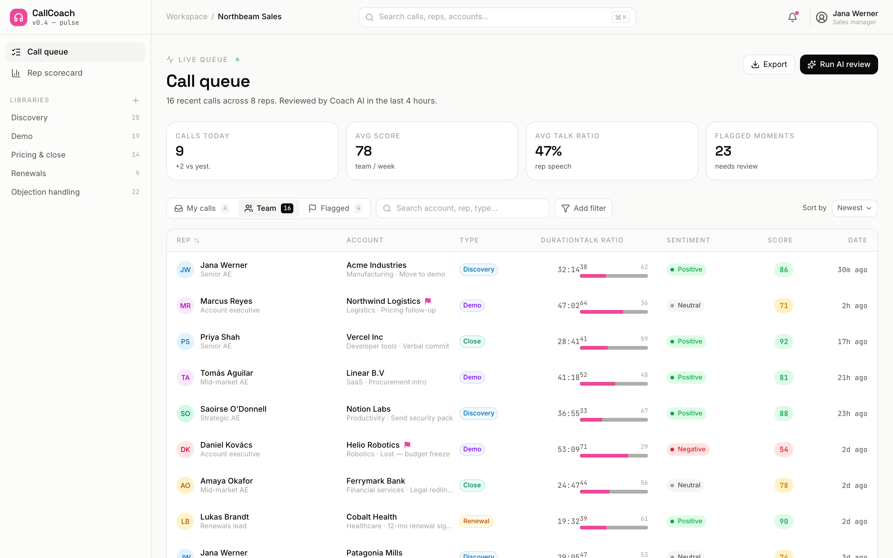
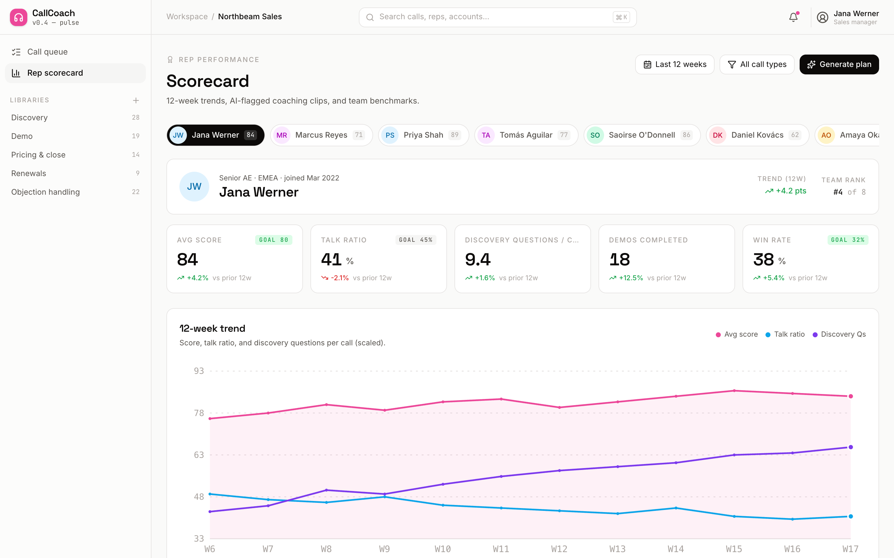
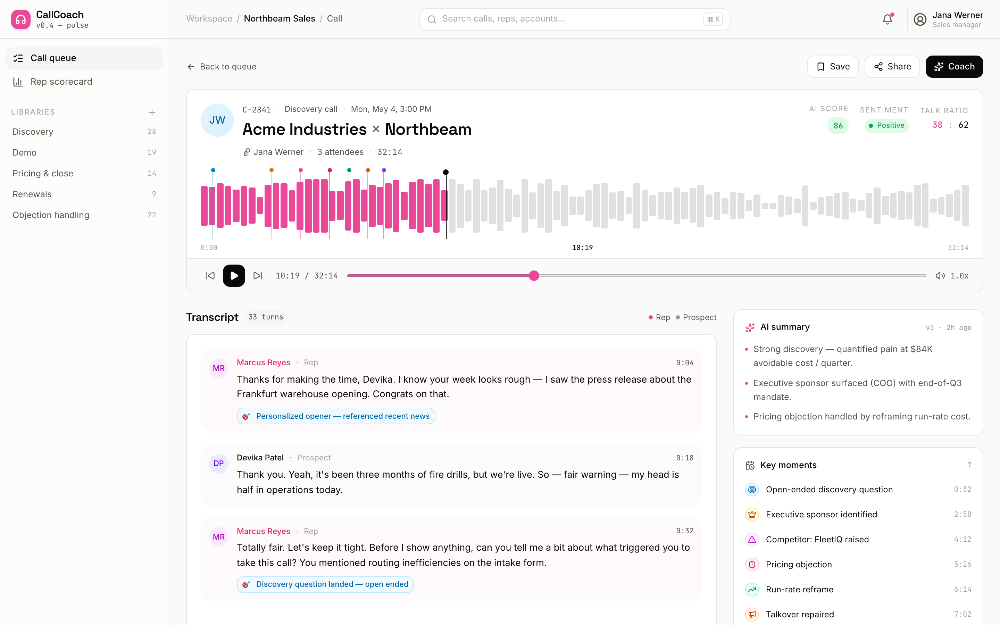

# CallCoach

Gong-style call review for sales teams.


CallCoach reviews every sales call for your team. Each transcript is annotated with AI-flagged moments — discovery questions, pricing objections, talkovers, filler words, champion signals — and rolled up into a 12-week scorecard per rep.

## Run locally

```bash
npm install
npm run dev -- -p 3004
```

Open <http://localhost:3004>.

```bash
npm run build   # production build
npm run start   # serve build
```

## Routes

| Path | What |
| --- | --- |
| `/` | Live call queue — 16 calls, sortable, filterable (My calls / Team / Flagged) |
| `/call/[id]` | Transcript view — waveform, inline AI annotations, summary rail, action items |
| `/scorecard` | Rep scorecard — 8 reps, 5 metrics, 12-week trend lines, 5 coaching clips |

## Stack

- Next.js 16 (App Router) + Turbopack
- TypeScript, Tailwind CSS v4 design tokens
- Framer Motion entrance animations
- lucide-react icons
- Inter / Space Grotesk / JetBrains Mono via `next/font`

## Screenshots

> Captured by QA after merge.

- 
- 
- 

## Layout

```
src/
  app/
    page.tsx              -> /
    call/[id]/page.tsx    -> /call/:id
    scorecard/page.tsx    -> /scorecard
  views/
    CallQueue.tsx
    CallDetail.tsx
    Scorecard.tsx
  components/
    Shell.tsx
    Avatar.tsx
    Waveform.tsx
    TrendChart.tsx
    SentimentChip.tsx
    ScorePill.tsx
    TalkRatioBar.tsx
  data/
    reps.ts
    calls.ts
    transcripts.ts
    coaching.ts
  lib/
    format.ts
```
